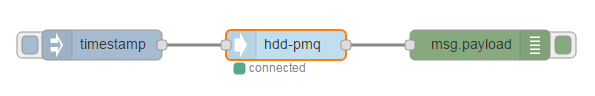
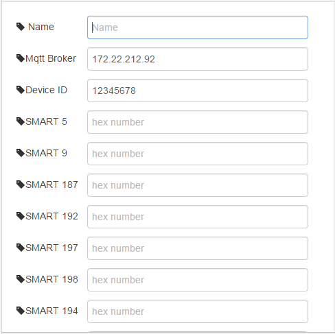

# node-red-contrib-hddpmq
A simple node that can configure HDD SMART code to do HDD failure prediction

## Usage example
**[hdd-pmq]**

- **Name :** *(Optional)* Place for entering the name of this node
- **Mqtt Broker :** MQTT broker's IP address or alias address name.
- **Device ID :** For PMQ model to identify device

## Tested Platform 

 
## History
- 0.2.1 - Feb 2017 : Initial Release

## License
Copyright 2017 ADVANTECH Corp. under the Apache 2.0 license(LICENSE)
